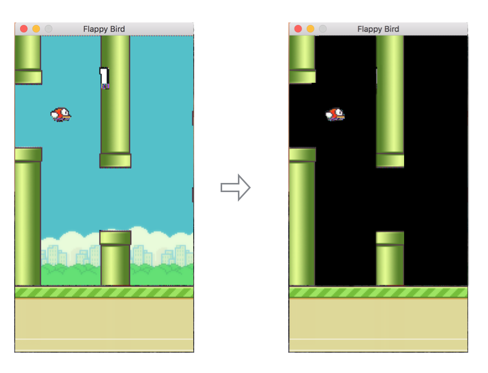

# 利用DQN学习如何玩FlappyBird


## 简介
做flappybird的目的是研究如何用增强学习训练一个智能agent。

## 需要安装的依赖包:
* Python 2.7 
* TensorFlow 1.0.0
* pygame
* OpenCV-Python

## 如何执行？
```
python deep_q_network.py
```

## DQN算法

从 [1] 可以看到DQN的伪码如下所示：

```
Initialize replay memory D to size N
Initialize action-value function Q with random weights
for episode = 1, M do
    Initialize state s_1
    for t = 1, T do
        With probability ϵ select random action a_t
        otherwise select a_t=max_a  Q(s_t,a; θ_i)
        Execute action a_t in emulator and observe r_t and s_(t+1)
        Store transition (s_t,a_t,r_t,s_(t+1)) in D
        Sample a minibatch of transitions (s_j,a_j,r_j,s_(j+1)) from D
        Set y_j:=
            r_j for terminal s_(j+1)
            r_j+γ*max_(a^' )  Q(s_(j+1),a'; θ_i) for non-terminal s_(j+1)
        Perform a gradient step on (y_j-Q(s_j,a_j; θ_i))^2 with respect to θ
    end for
end for
```

## 实验

#### 环境（Environment）
FlappyBird游戏画面由连续多帧图片组成，这些图片像素构成了DQN的原始输入数据。 [3] 指出，去除原始游戏的背景可以更快的收敛。效果如下：



#### 网络结构
根据文章 [1], 首先按照如下步骤对游戏画面进行处理：

1. 将图片转为灰度图
2. 调整画面为 80*80的尺寸
3. 将最临近4帧画面构成 80x80x4 的数组，作为网络的输入

整体结构如图所示 ：


#### 训练

## References

[1] Mnih Volodymyr, Koray Kavukcuoglu, David Silver, Andrei A. Rusu, Joel Veness, Marc G. Bellemare, Alex Graves, Martin Riedmiller, Andreas K. Fidjeland, Georg Ostrovski, Stig Petersen, Charles Beattie, Amir Sadik, Ioannis Antonoglou, Helen King, Dharshan Kumaran, Daan Wierstra, Shane Legg, and Demis Hassabis. **Human-level Control through Deep Reinforcement Learning**. Nature, 529-33, 2015.

[2] Volodymyr Mnih, Koray Kavukcuoglu, David Silver, Alex Graves, Ioannis Antonoglou, Daan Wierstra, and Martin Riedmiller. **Playing Atari with Deep Reinforcement Learning**. NIPS, Deep Learning workshop

[3] Kevin Chen. **Deep Reinforcement Learning for Flappy Bird** [Report](http://cs229.stanford.edu/proj2015/362_report.pdf) | [Youtube result](https://youtu.be/9WKBzTUsPKc)

## 参考项目

1. [sourabhv/FlapPyBird] (https://github.com/sourabhv/FlapPyBird)
2. [asrivat1/DeepLearningVideoGames](https://github.com/asrivat1/DeepLearningVideoGames)
3. [https://github.com/yenchenlin/DeepLearningFlappyBird](https://github.com/yenchenlin/DeepLearningFlappyBird)

